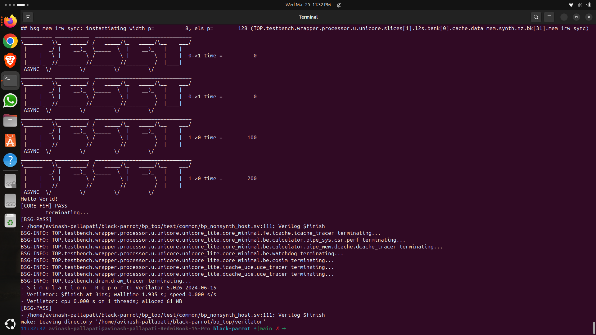

# BlackParrot RISC-V Processor Simulation using Verilator

This project demonstrates the simulation of the BlackParrot RISC-V processor using Verilator 5.

## What I Did

* Installed and configured BlackParrot environment
* Resolved build and simulation errors
* Successfully ran full-system simulation
* Verified output with PASS result

## Tools Used

* Ubuntu Linux
* Verilator 5
* Git & GitHub

## Result

Simulation completed successfully with PASS status.

## Simulation Output

## Key Learning

* Understanding of RISC-V architecture
* Verilog simulation using Verilator
* Debugging hardware design errors

## Author

Avinash Pallapati
